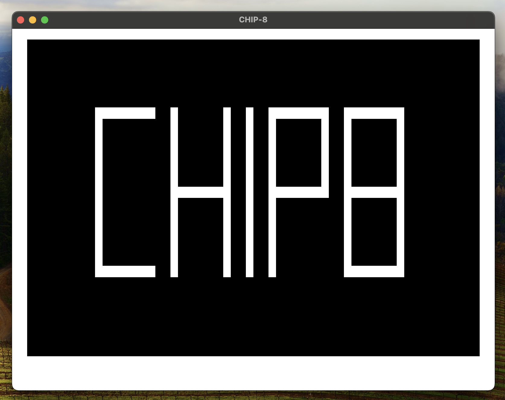

# rust-chip8-opengl
[](https://crates.io/crates/rust-chip8-opengl)
[](https://docs.rs/rust-chip8-opengl/1.0.0/rust_chip8_opengl/)


A CHIP-8 emulator written in rust.
Can be used both as a standalone application, running CHIP-8 ROMs in terminal or in a separate window,
or as a library to simulate a CHIP-8 processor.

## Install
`cargo install rust-chip8-opengl`

## Usage
### Usage as an emulator
`rust-chip8-opengl [OPTIONS]`

Available options:
* `-f, --file [FILE]`: The CHIP-8 file to run, i.e. `-f ./my_game.ch8`.
  Can be omitted to run the emulator in an interactive mode where the use enters opcodes manually.
* `-m, --mode [MODE]`: The mode to run the emulator in, either `terminal` or `open-gl`.
* `--debug-file [FILE]`: The file to log the opcodes to. If omitted, no opcodes are logged.

Key map:

| CHIP-8 Key | Keyboard Key |
-----------------------------
| 0 | x |
| 1 | 1 |
| 2 | 2 |
| 3 | 3 | 
| 4 | Q |
| 5 | W |
| 6 | E |
| 7 | A |
| 8 | S |
| 9 | D |
| A | Z |
| B | C |
| C | 4 |
| D | R |
| E | F |
| F | V |

Note that if ran in terminal mode, each keypress will toggle that key being on.
So pressing `W` would toggle the chip's `5` key, and the user would
have to press `W` again to release the key.
### Usage as a library
TBA

## Examples
`cargo run -- -f ./Chip8Picture.ch8 -m terminal`
```
[][][][][][][][][][][][][][][][][][][][][][][][][][][][][][][][][][][][][][][][][][][][][][][][][][][][][][][][][][][][][][][][]
[][][][][][][][][][][][][][][][][][][][][][][][][][][][][][][][][][][][][][][][][][][][][][][][][][][][][][][][][][][][][][][][]
[][]                                                                                                                        [][]
[][]                                                                                                                        [][]
[][]                                                                                                                        [][]
[][]                                                                                                                        [][]
[][]                                                                                                                        [][]
[][]                                                                                                                        [][]
[][]                  [][][][][][][][]    []            []    []    [][][][][][][][]    [][][][][][][][]                    [][]
[][]                  []                  []            []    []    []            []    []            []                    [][]
[][]                  []                  []            []    []    []            []    []            []                    [][]
[][]                  []                  []            []    []    []            []    []            []                    [][]
[][]                  []                  []            []    []    []            []    []            []                    [][]
[][]                  []                  []            []    []    []            []    []            []                    [][]
[][]                  []                  []            []    []    []            []    []            []                    [][]
[][]                  []                  [][][][][][][][]    []    [][][][][][][][]    [][][][][][][][]                    [][]
[][]                  []                  []            []    []    []                  []            []                    [][]
[][]                  []                  []            []    []    []                  []            []                    [][]
[][]                  []                  []            []    []    []                  []            []                    [][]
[][]                  []                  []            []    []    []                  []            []                    [][]
[][]                  []                  []            []    []    []                  []            []                    [][]
[][]                  []                  []            []    []    []                  []            []                    [][]
[][]                  [][][][][][][][]    []            []    []    []                  [][][][][][][][]                    [][]
[][]                                                                                                                        [][]
[][]                                                                                                                        [][]
[][]                                                                                                                        [][]
[][]                                                                                                                        [][]
[][]                                                                                                                        [][]
[][]                                                                                                                        [][]
[][]                                                                                                                        [][]
[][][][][][][][][][][][][][][][][][][][][][][][][][][][][][][][][][][][][][][][][][][][][][][][][][][][][][][][][][][][][][][][]
[][][][][][][][][][][][][][][][][][][][][][][][][][][][][][][][][][][][][][][][][][][][][][][][][][][][][][][][][][][][][][][][]

  PC  |  I   |  V0  |  V1  |  V2  |  V3  |  V4  |  V5  |  V6  |  V7  |  V8  |  V9  |  Va  |  Vb  |  Vc  |  Vd  |  Ve  |  Vf  |
 0x246| 0x294| 0x2C |  0x8 | 0x10 |  0x0 |  0x0 |  0x0 |  0x0 |  0x0 |  0x0 |  0x0 |  0x0 |  0x0 |  0x0 |  0x0 |  0x0 |  0x0 |
  DT  |  ST  |  I0  |  I1  |  I2  |  I3  |  I4  |  I5  |  I6  |  I7  |  I8  |  I9  |  IA  |  IB  |  IC  |  ID  |  IE  |  IF  
  0x0 |  0x0 |  F   |  F   |  F   |  F   |  F   |  F   |  F   |  F   |  F   |  F   |  F   |  F   |  F   |  F   |  F   |  F   
```

`cargo run -- -f Chip8Picture.ch8 -m open-gl`

